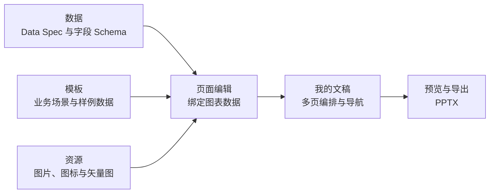
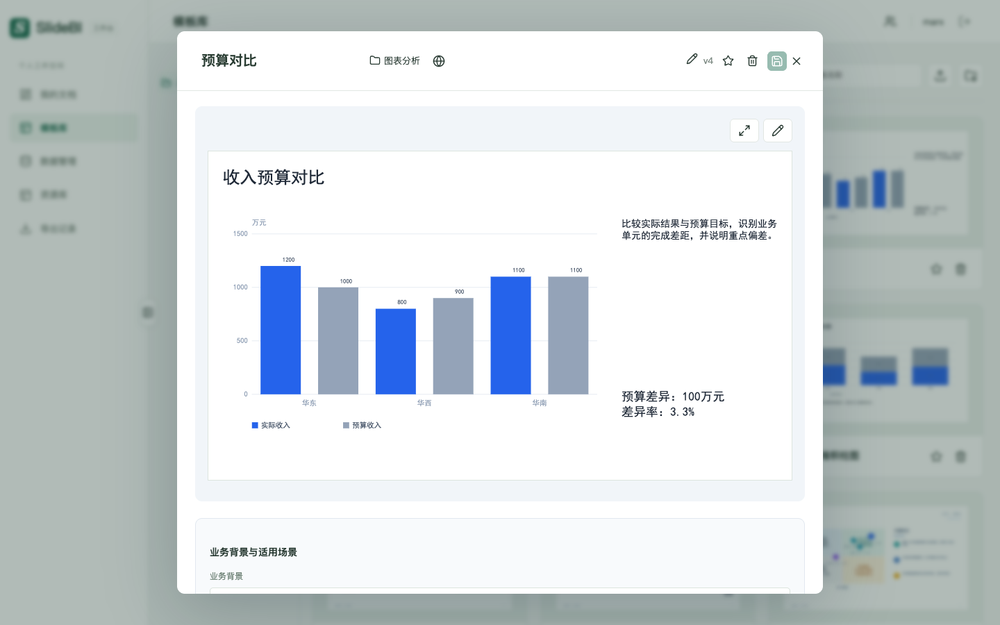
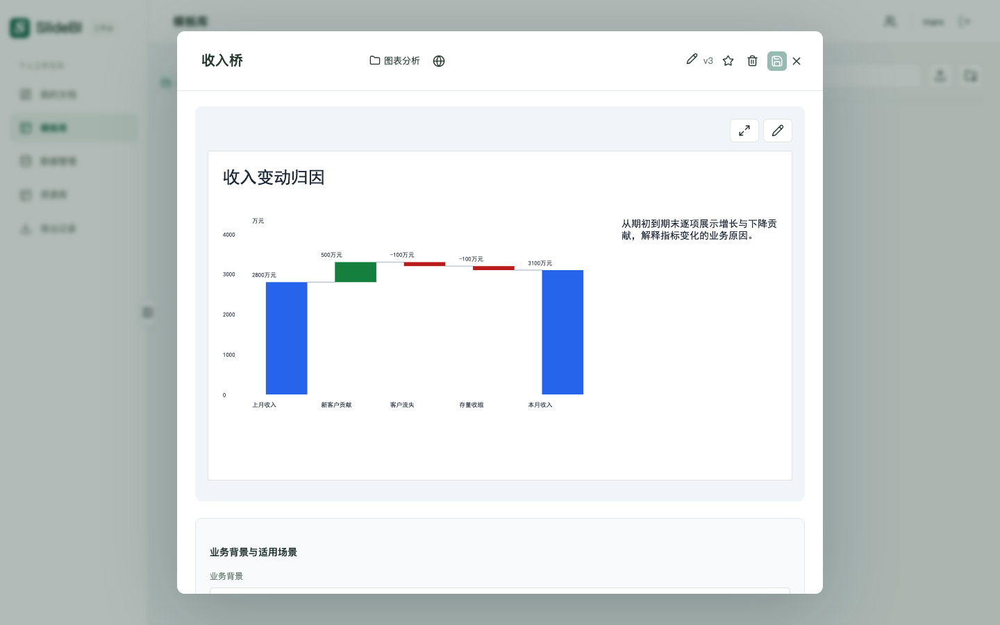
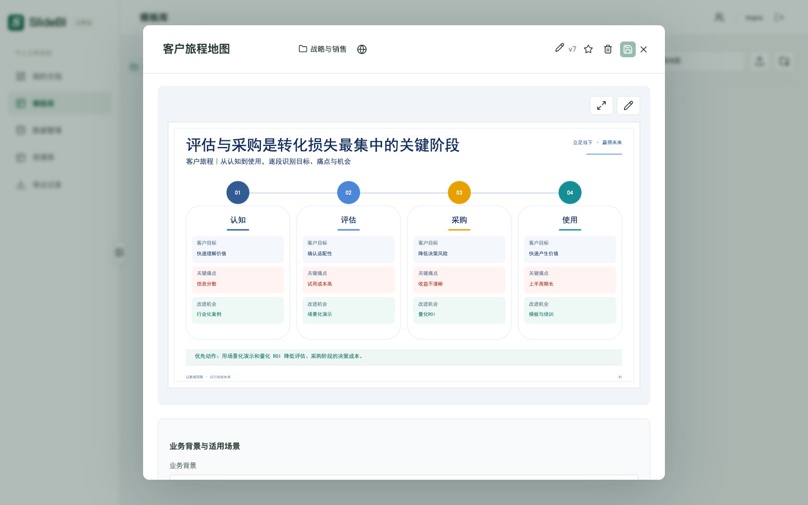
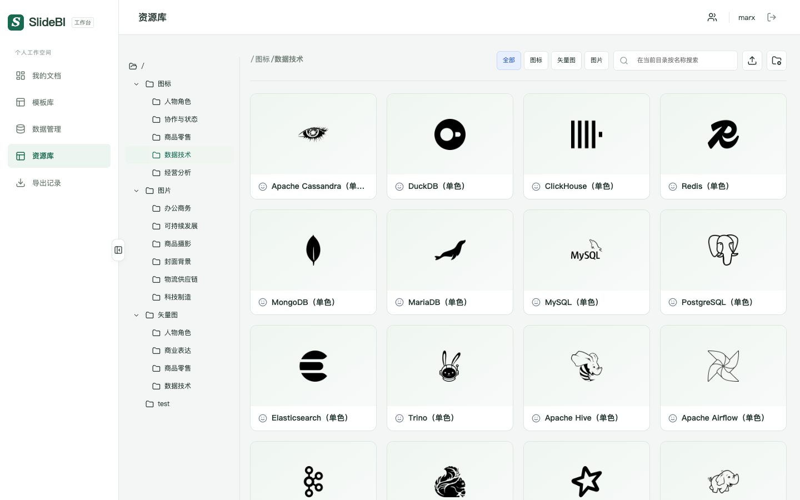
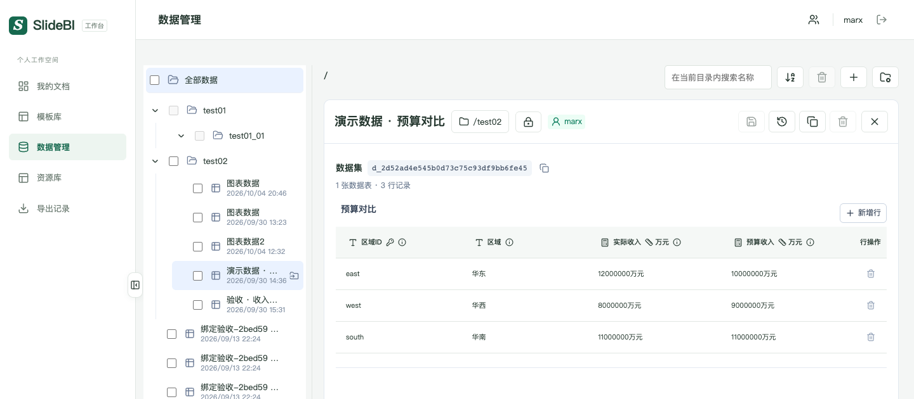
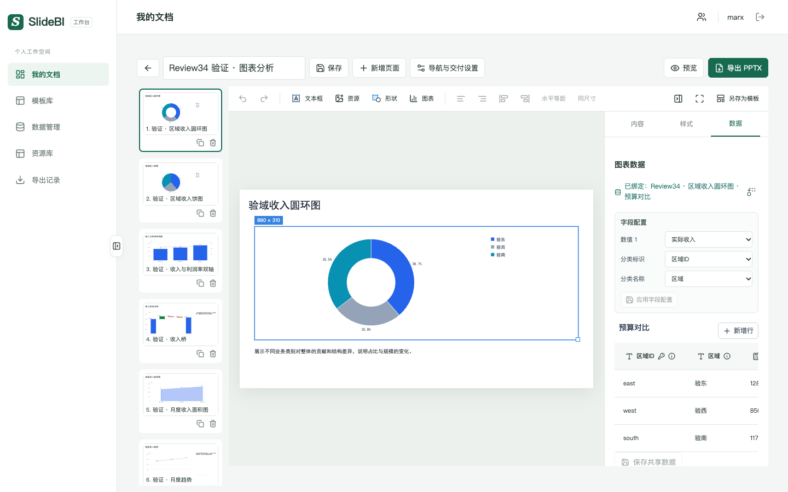

# SlideBI

SlideBI 把 BI 图表数据与商业汇报模板组合为可编辑的多页文稿，并导出可直接打开和继续编辑的 PPTX。项目包含 React 前端、Express 后端、共享演示文稿引擎、PostgreSQL 迁移以及完整的自动化测试。

当前公开版本：**v0.1.1**。真实 BI Studio Data Spec/DAX 接口尚未接入，开发环境使用 Mock 适配器。

## 从业务数据到可交付汇报

SlideBI 位于 BI 分析与经营汇报之间：数据团队提供结构化图表数据，业务人员选择成熟的商业模板并补充文字、图形和视觉资源，系统负责把各页组织为可预览、可追溯、可继续编辑的 PowerPoint 文稿。



这套工作流解决四个常见问题：

- **复用汇报方法**：模板保存业务背景、适用场景、页面设计和配套样例数据，不再从空白页重复搭建。
- **保持数据一致**：图表通过稳定的表 ID、字段 ID 绑定数据集；数据更新后，文稿中的引用图表会按最新版本重新渲染。
- **集中管理素材**：图片、图标和 SVG 按目录管理，可以上传、预览、加工并用于页面编辑。
- **稳定交付结果**：页面编辑使用最新数据，保存文稿时形成快照，预览和历史导出使用冻结版本。

## 核心概念与交互

### 模板：沉淀商业汇报最佳实践

模板是一张完整的业务汇报页面，包含业务背景、适用场景、图表与文字布局，以及能够直接展示的表格样例数据。用户可以按目录浏览和预览模板；owner 可以维护模板信息、页面和配套数据。导入文稿后，页面会成为独立副本，后续编辑不会受到模板版本变化影响。

**预算对比**：用实际与预算的并列比较快速识别业务差距。



**收入桥（瀑布图）**：从期初值逐项解释正负变化贡献，并落到期末结果。



**客户旅程地图**：把客户目标、关键痛点和改进机会组织成可执行的业务叙事，体现模板也能承载管理分析框架。



### 资源：为页面提供统一视觉素材

资源库集中管理图片、图标和矢量图，使用独立目录树组织人物角色、商业表达、数据技术、商品图片等素材。系统支持文件上传和 SVG 代码导入；资源加工以预览、下载或另存副本的方式完成，不覆盖原始素材。



### 数据：管理每个图表的结构化输入

数据集面向图表维护表格数据和字段 Schema，而不是暴露完整 BI 模型。每个数据集拥有稳定的 `d_` 标识，表和字段使用稳定 ID 建立引用；名称、字段显示名和数据可独立修改。修改会产生历史版本并保留最近六版，支持回滚。当前支持人工录入和 BI Studio Mock 导入，并为后续 `chartId`、DAX 与模型 ID 刷新接口保留适配层。



#### 数据更新如何进入文稿

当图表绑定数据管理中的数据集后，数据管理就是该图表的输入来源。人工修改或 BI 刷新会发布新的数据集当前版本；文稿重新加载或回到编辑窗口时，会取得最新数据并重新渲染所有引用该数据集的图表。用户执行“保存”后形成文稿快照，预览和导出继续使用冻结版本，因此最新数据更新与历史汇报复现可以同时成立。


模板导入页面时会先使用模板自带数据；需要持续跟随业务数据变化时，可以把图表数据托管到数据管理并建立绑定。页面私有数据保持独立，不会被其他数据集更新影响。

### 我的文稿：完成多页汇报编排与交付

文稿是最终交付物。用户可以从模板导入页面或创建空白页，再插入文字、资源、形状、表格和图表。编辑区同时提供页面缩略图、画布工具栏和内容/样式/数据属性；图表既能使用页面私有数据，也能绑定数据管理中的共享数据集。完成后可配置导航、预览全部页面，并导出标准 `.pptx` 文件。



模板、资源、数据和文稿均采用 owner 与公开/私有可见性管理：私有内容仅 owner 可见，公开内容可供其他用户预览；修改和删除仍由 owner 控制。

## 快速开始

需要 Node.js 22+、npm 10+ 和 PostgreSQL 16+。

```bash
git clone git@github.com:zhangxiading1982/cognite-report.git
cd cognite-report
npm run setup
npm run dev
```

打开 <http://127.0.0.1:5173>。开发账号：

| 用户 | 密码 | 角色 |
| --- | --- | --- |
| `marx` | `admin` | 管理员 |
| `summer` | `summer` | 普通用户 |
| `mary` | `mary` | 普通用户 |

默认数据库初始化需要当前 PostgreSQL 用户具备建库、建角色权限。连接方式不同或端口冲突时，请参考 [.env.example](.env.example) 和[环境准备文档](docs/environment-setup.md)。

## 常用命令

```bash
npm run env:check       # 检查本机依赖
npm run db:init -- --with-test
npm run db:seed         # 写入内置主题、模板、目录和资源
npm run dev             # 同时启动前端和后端
npm run verify          # 类型检查、单元/集成测试、前端构建
npm run test:e2e        # dev 服务运行时执行浏览器验收
npm run release:check   # 完整发布检查
```

后端健康检查：<http://127.0.0.1:4310/api/health>。

## 文档

- [文档导航](docs/README.md)
- [系统功能说明](docs/system-overview.md)
- [环境准备与初始化](docs/environment-setup.md)
- [系统架构](docs/architecture.md)
- [使用说明](docs/user-guide.md)
- [v0.1.1 发布说明](docs/releases/v0.1.1.md)
- [贡献指南](CONTRIBUTING.md)与[安全说明](SECURITY.md)

项目受数据驱动汇报工具的工作流启发，采用独立设计与实现，与 think-cell GmbH 没有关联。

> 项目所有者尚未选择开源许可证。在许可证文件加入前，公开源码不自动授予复制、修改或再分发权利。
