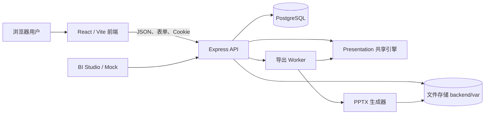

# 系统架构

## 组件

- **前端**负责目录浏览、数据维护、模板预览、画布编辑和导出任务交互。
- **API**负责身份、所有权、输入校验、事务、版本冲突和持久任务。
- **Presentation 包**是浏览器和后端共享的纯 TypeScript 内核，负责契约、数值语义、布局和 SVG 编译。
- **PostgreSQL**保存业务对象、不可变修订、会话与任务状态。
- **文件存储**保存资源原件、缩略图和导出文件。数据库只保存对象元数据与引用。
- **Worker**从数据库领取带租约的导出任务，使用冻结修订生成 PPTX。

## 主要数据流

### 数据导入与刷新

人工数据或 BI `chartId` 进入 API 后先通过 Data Spec 校验，再写入不可变快照并发布数据集版本。刷新只有在上游内容变化时发布新版本；人工订正和回滚不会被常规检查静默覆盖。

### 页面编辑

模板导入会复制页面和模板配套数据。空白页可插入图表并绑定数据管理中的数据集。前端自动保存页面，后端以修订号执行乐观并发控制。共享引擎使用同一份数据和布局规则生成浏览器 SVG。

### 文稿导出

文稿预览冻结页面顺序、页面修订和数据版本。导出任务只消费冻结内容，不在生成过程中重查 BI。PPTX 使用原生文字、形状、表格和可编辑图表；资源经过格式与尺寸校验后写入文件。

## 设计约束

1. 业务写入必须在 PostgreSQL 事务中完成，并校验 owner、可见性和期望版本。
2. 已发布快照和修订不可修改；更新通过新版本表达。
3. 页面引用表和字段时使用稳定 ID，名称仅用于展示。
4. 前端预览与 PPTX 使用同一编译结果，避免重复计算业务数据。
5. 数据库和 `backend/var` 必须作为一个备份单元。
6. 真实 BI 连接通过适配器接入；未配置时只能使用明确标识的 Mock。
